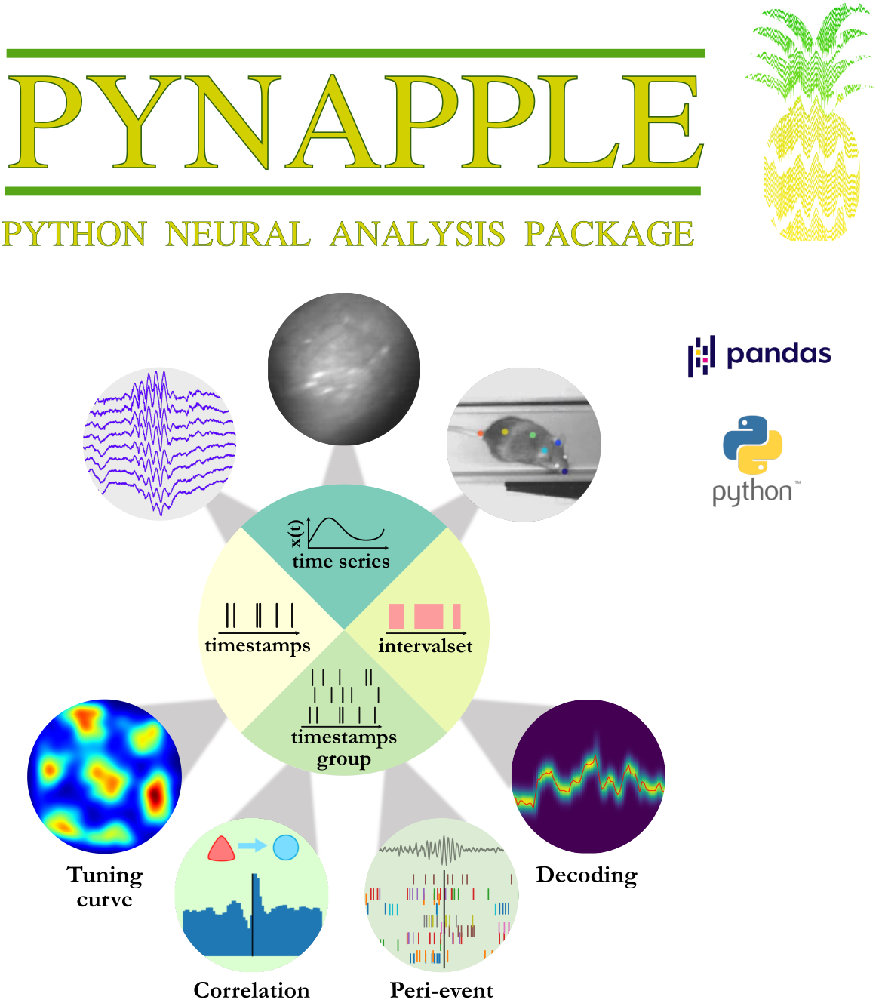

<!--  -->
<p align="center">
  
</p>


<!-- ========================== -->

[](https://pypi.python.org/pypi/pynapple)
[](https://github.com/pynapple-org/pynapple/actions/workflows/main.yml)
[](https://coveralls.io/github/pynapple-org/pynapple?branch=main)
[](https://github.com/pynapple-org/pynapple/issues)


PYthon Neural Analysis Package.

pynapple is a light-weight python library for neurophysiological data analysis. The goal is to offer a versatile set of tools to study typical data in the field, i.e. time series (spike times, behavioral events, etc.) and time intervals (trials, brain states, etc.). It also provides users with generic functions for neuroscience such as tuning curves and cross-correlograms.

-   Free software: MIT License
-   __Documentation__: <https://pynapple-org.github.io/pynapple>
-   __Notebooks and tutorials__ : <https://pynapple-org.github.io/pynapple/generated/gallery/>
<!-- -   __Collaborative repository__: <https://github.com/pynapple-org/pynacollada> -->


> **Note**
> :page_with_curl: If you are using pynapple, please cite the following [biorxiv paper](https://www.biorxiv.org/content/10.1101/2022.12.06.519376v1)

------------------------------------------------------------------------

:fire::fire::fire::fire::fire::fire::fire::fire: New release :fire::fire::fire::fire::fire::fire::fire::fire::fire::fire:
---------------
Starting with 0.4, pynapple rely on the [numpy array container](https://numpy.org/doc/stable/user/basics.dispatch.html) approach instead of Pandas. Pynapple builtin functions will remain the same except for functions inherited from Pandas. Typically this line of code in `pynapple<=0.3.6` :
```python
meantsd = tsdframe.mean(1)
```
is now:
```python
meantsd = np.mean(tsdframe, 1)
```
in `pynapple>=0.4.0`. This allows for a better handling of returned objects.

Additionaly, it is now possible to define time series objects with more than 2 dimensions with `TsdTensor`. You can also look at this [notebook](https://pynapple-org.github.io/pynapple/generated/gallery/tutorial_pynapple_numpy/) for a demonstration of numpy compatibilities.

:fire::fire::fire::fire::fire::fire::fire::fire::fire::fire::fire::fire::fire::fire::fire::fire::fire::fire::fire::fire::fire::fire::fire:
---------------

Getting Started
---------------

### Installation

The best way to install pynapple is with pip within a new [conda](https://docs.conda.io/en/latest/) environment :

    
``` {.sourceCode .shell}
$ conda create --name pynapple pip python=3.8
$ conda activate pynapple
$ pip install pynapple
```

or directly from the source code:

``` {.sourceCode .shell}
$ conda create --name pynapple pip python=3.8
$ conda activate pynapple
$ # clone the repository
$ git clone https://github.com/pynapple-org/pynapple.git
$ cd pynapple
$ # Install in editable mode with `-e` or, equivalently, `--editable`
$ pip install -e .
```
> **Note**
> The package is now using a pyproject.toml file for installation and dependencies management. If you want to run the tests, use pip install -e .[dev]

This procedure will install all the dependencies including 

-   pandas
-   numpy
-   scipy
-   numba
-   pynwb 2.0
-   tabulate
-   h5py

For spyder users, it is recommended to install spyder after installing pynapple with :

``` {.sourceCode .shell}
$ conda create --name pynapple pip python=3.8
$ conda activate pynapple
$ pip install pynapple
$ pip install spyder
$ spyder
```


Basic Usage
-----------

After installation, you can now import the package: 

``` {.sourceCode .shell}
$ python
>>> import pynapple as nap
```

You'll find an example of the package below. Click [here](https://www.dropbox.com/s/su4oaje57g3kit9/A2929-200711.zip?dl=1) to download the example dataset. The folder includes a NWB file containing the data.

``` py
import matplotlib.pyplot as plt
import numpy as np

import pynapple as nap

# LOADING DATA FROM NWB
data = nap.load_file("A2929-200711.nwb")

spikes = data["units"]
head_direction = data["ry"]
wake_ep = data["position_time_support"]

# COMPUTING TUNING CURVES
tuning_curves = nap.compute_1d_tuning_curves(
    spikes, head_direction, 120, ep=wake_ep, minmax=(0, 2 * np.pi)
)


# PLOT
plt.figure()
for i in spikes:
    plt.subplot(3, 5, i + 1, projection="polar")
    plt.plot(tuning_curves[i])
    plt.xticks([0, np.pi / 2, np.pi, 3 * np.pi / 2])

plt.show()
```
Shown below, the final figure from the example code displays the firing rate of 15 neurons as a function of the direction of the head of the animal in the horizontal plane.

<!--  -->
<p align="center">
  
</p>


### Credits

Special thanks to Francesco P. Battaglia
(<https://github.com/fpbattaglia>) for the development of the original
*TSToolbox* (<https://github.com/PeyracheLab/TStoolbox>) and
*neuroseries* (<https://github.com/NeuroNetMem/neuroseries>) packages,
the latter constituting the core of *pynapple*.

This package was developped by Guillaume Viejo
(<https://github.com/gviejo>) and other members of the Peyrache Lab.

Logo: Sofia Skromne Carrasco, 2021.
