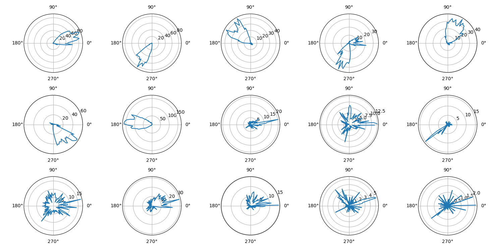

---
hide:
  - navigation
---

New releases :fire:
------------------

### pynapple >= 0.7

Pynapple now implements signal processing. For example, to filter a 1250 Hz sampled time series between 10 Hz and 20 Hz:

```python
nap.apply_bandpass_filter(signal, (10, 20), fs=1250)
```
New functions includes power spectral density and Morlet wavelet decomposition. See the [documentation](https://pynapple-org.github.io/pynapple/reference/process/) for more details.

### pynapple >= 0.6

Starting with 0.6, [`IntervalSet`](https://pynapple-org.github.io/pynapple/reference/core/interval_set/) objects are behaving as immutable numpy ndarray. Before 0.6, you could select an interval within an `IntervalSet` object with:

```python
new_intervalset = intervalset.loc[[0]] # Selecting first interval
```

With pynapple>=0.6, the slicing is similar to numpy and it returns an `IntervalSet`

```python
new_intervalset = intervalset[0]
```

### pynapple >= 0.4

Starting with 0.4, pynapple rely on the [numpy array container](https://numpy.org/doc/stable/user/basics.dispatch.html) approach instead of Pandas for the time series. Pynapple builtin functions will remain the same except for functions inherited from Pandas. 

This allows for a better handling of returned objects.

Additionaly, it is now possible to define time series objects with more than 2 dimensions with `TsdTensor`. You can also look at this [notebook](https://pynapple-org.github.io/pynapple/generated/api_guide/tutorial_pynapple_numpy/) for a demonstration of numpy compatibilities.


Basic Usage
-----------

After installation, you can now import the package: 

``` {.sourceCode .shell}
$ python
>>> import pynapple as nap
```

You'll find an example of the package below. Click [here](https://www.dropbox.com/s/su4oaje57g3kit9/A2929-200711.zip?dl=1) to download the example dataset. The folder includes a NWB file containing the data.

``` py
import matplotlib.pyplot as plt
import numpy as np

import pynapple as nap

# LOADING DATA FROM NWB
data = nap.load_file("A2929-200711.nwb")

spikes = data["units"]
head_direction = data["ry"]
wake_ep = data["position_time_support"]

# COMPUTING TUNING CURVES
tuning_curves = nap.compute_1d_tuning_curves(
    spikes, head_direction, 120, minmax=(0, 2 * np.pi)
)


# PLOT
plt.figure()
for i in spikes:
    plt.subplot(3, 5, i + 1, projection="polar")
    plt.plot(tuning_curves[i])
    plt.xticks([0, np.pi / 2, np.pi, 3 * np.pi / 2])

plt.show()
```
Shown below, the final figure from the example code displays the firing rate of 15 neurons as a function of the direction of the head of the animal in the horizontal plane.


<!-- <p align="center">
  
</p>
 -->